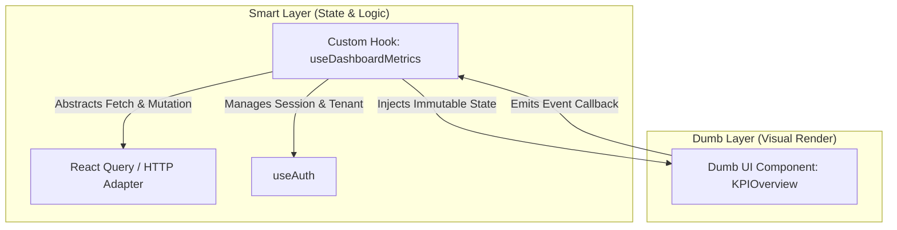

# 🧠 ZEHLA PRIME — SPEC_FRONTEND.md (A Pele do Sistema)

Este documento estabelece o manifesto arquitetural e as regras de sincronização mestra para o desenvolvimento da Camada de Apresentação (Frontend UI) do ecossistema ZEHLA SmartHotel. O frontend opera sob a rígida separação de **Estado vs Renderização (State vs View)** e o paradigma **Spec-Driven Development (SDD)**.

---

## 🏛️ 1. O Padrão de Componentização (Arquitetura Decoupled)

Para impedir o acoplamento tóxico de lógica de rede e persistência com código visual, a interface do ZEHLA divide-se estritamente em duas categorias:



### 1.1 Dumb Components (Apresentação Pura)
* **Regra de Ouro**: São componentes anêmicos de lógica de negócios. Eles apenas recebem dados tipados via `Props` e emitem interações do usuário através de callbacks de eventos (`onClick`, `onChange`, `onSubmit`).
* **Estilo e Identidade**: Utilizam Tailwind CSS v4 e seguem as variáveis estabelecidas em `DESIGN.md`.
* **Sem Efeitos Colaterais**: É terminantemente proibida a importação de bibliotecas de rede (`axios`, `fetch`), gerenciadores globais de estado ou cookies dentro destes arquivos.
* **Estado Local**: Só é permitido o uso de `useState` para comportamentos estritamente visuais e efêmeros (como abrir/fechar um dropdown, aba visível ou estado de foco).

### 1.2 Smart Hooks (Cérebro da Interface)
* **Regra de Ouro**: Toda e qualquer regra de interface, chamadas a endpoints HTTP, cacheamento de consultas e gerenciamento de estado global reside em **Hooks Personalizados (`custom hooks`)**.
* **Tratamento de Dados**: Os hooks consomem os adaptadores de cliente HTTP puros, traduzem as respostas do backend para o formato reativo e cuidam do ciclo de vida das transições.

---

## 🎣 2. Mapeamento de Hooks Personalizados (Smart Hooks)

Toda a reatividade e orquestração do sistema está catalogada sob as assinaturas destes 6 ganchos customizados principais:

### 2.1 `useAuth()`
Gerencia a sessão local, tokens de autenticação (JWT) e o isolamento de tenant de forma imperceptível na interface.
```typescript
interface TenantSession {
  token: string;
  userId: string;
  pousadaId: string;
  role: 'admin' | 'hoteleiro' | 'operador';
}

export function useAuth(): {
  session: TenantSession | null;
  isAuthenticated: boolean;
  login: (credentials: LoginInput) => Promise<Result<TenantSession, Error>>;
  logout: () => void;
}
```

### 2.2 `useZehlaBrain()`
Orquestra o radar neural e a tomada de decisões da IA em tempo real no dashboard central (ZCC).
```typescript
interface CognitiveEvent {
  eventId: string;
  timestamp: Date;
  intent: string;
  origem: string;
  needsEscalation: boolean;
  handoffRequired: boolean;
  responseText: string;
}

export function useZehlaBrain(): {
  events: CognitiveEvent[];
  isThinking: boolean;
  triggerManualIntent: (intent: string, payload: any) => Promise<Result<void, Error>>;
  escalateToHuman: (eventId: string) => Promise<Result<void, Error>>;
}
```

### 2.3 `useDashboardMetrics()`
Consome e encapsula a inteligência analítica do *Zé-Analyst*, monitorando a precificação dinâmica e o faturamento.
```typescript
interface YieldMetrics {
  faturamentoTotal: number;
  taxaOcupacao: number;
  revPar: number;
  breakEvenStatus: 'safe' | 'warning' | 'danger';
}

export function useDashboardMetrics(periodo: { inicio: Date; fim: Date }): {
  metrics: YieldMetrics | null;
  loading: boolean;
  recalcularBreakEven: (valorPretendido: number) => Promise<Result<boolean, Error>>;
}
```

### 2.4 `useReservations()`
Interface do motor de hospitalidade (*Zé-Host*), incluindo controle sanitário do check-in mobile e Gov.br.
```typescript
interface Reservation {
  id: string;
  hospedeNome: string;
  status: 'reservado' | 'checkin_mobile' | 'in_house' | 'checkout';
  govBrVerified: boolean;
  roomNumber?: string;
}

export function useReservations(): {
  reservations: Reservation[];
  realizarCheckInMobile: (id: string, qrCodeData: string) => Promise<Result<void, Error>>;
  alocarQuarto: (id: string, quartoId: string) => Promise<Result<void, Error>>;
}
```

### 2.5 `useLeadsKanban()`
Encapsula o fluxo do CRM comercial (*Zé-Sales*) em colunas de funil dinâmicas baseadas em pontuação.
```typescript
interface LeadCard {
  id: string;
  nome: string;
  status: 'novo' | 'qualificado' | 'propostado' | 'convertido' | 'perdido';
  score: number;
  canal: string;
}

export function useLeadsKanban(): {
  leads: Record<string, LeadCard[]>;
  moverLead: (leadId: string, novoStatus: string) => Promise<Result<void, Error>>;
  qualificarLead: (leadId: string) => Promise<Result<number, Error>>;
}
```

### 2.6 `useOperationsTasks()`
Gerencia os tickets de limpeza e manutenção predial em tempo real (*Zé-Ops*).
```typescript
interface TaskItem {
  id: string;
  quartoId: string;
  tipo: 'limpeza' | 'manutencao';
  status: 'pendente' | 'em_progresso' | 'concluido';
  responsavel?: string;
}

export function useOperationsTasks(): {
  tasks: TaskItem[];
  criarTarefa: (payload: { quartoId: string; tipo: 'limpeza' | 'manutencao' }) => Promise<Result<void, Error>>;
  atualizarStatusTarefa: (id: string, status: 'pendente' | 'em_progresso' | 'concluido') => Promise<Result<void, Error>>;
}
```

---

## 🏛️ 3. Mapeamento de Componentes Críticos (ZCC Core)

Estes são os três módulos de exibição fundamentais do **Zehla Control Center (ZCC)**. Eles devem ser criados como componentes puramente visuais, decorados pelo Tailwind e alimentados exclusivamente pelos hooks acima:

### 3.1 `CognitiveTerminal`
* **Estética**: Pitch-Black total (`#0F172A`), com bordas sutis laranjas (`#F97316`), tipografia Outfit, e um efeito de vidro glassmorphic (`backdrop-filter`).
* **Visualização**: Um feed em cascata (Radar Neural) apresentando em tempo real o processamento cognitivo das IAs de borda. Nós com `needsEscalation: true` piscam em vermelho pulsante e habilitam botões de intervenção manual imediatos.

### 3.2 `LeadKanban`
* **Estética**: Colunas flutuantes Slate 800 (`#1E293B`) com divisores finos Slate 700 (`#334155`).
* **Comportamento**: Cards de Lead com bordas brilhantes coloridas dependendo de sua temperatura de conversão baseada em Score:
  - **Quente (Score >= 70)**: Borda verde vibrante (`#10B981`)
  - **Morno (40 <= Score < 70)**: Borda laranja suave (`#F97316`)
  - **Frio (Score < 40)**: Sem destaque de borda.
* **Ações**: Controles de drag-and-drop rápidos e gatilhos na UI para disparar propostas instantâneas direto do Kanban.

### 3.3 `RoomsGrid`
* **Estética**: Visualizações modulares em formato Grid representando todos os quartos da pousada.
* **Inovações Regulatórias 2026**:
  - Exibição em tempo real do cronômetro de higienização de 3 horas (Ciclo de diárias 24h).
  - Indicador visual da validação do Cadastur/Gov.br na diária corrente.
  - Alerta de check-in pendente com botão flutuante para geração de QR Code FNRH.

---

## 🔌 4. Clientes HTTP (Adapters Camada Azul)

As conexões com o backend SB21 são totalmente delegadas a classes de serviço escritas em TypeScript puro. Nenhuma linha de rede vaza para a interface do React.

### 4.1 Encapsulamento de Retorno `Result<T, E>`
Todos os métodos de api retornam uma promessa do padrão `Result` unificado do sistema, garantindo um tratamento de falhas em tempo de compilação:

```typescript
export class SalesServiceAdapter {
  constructor(private readonly httpClient: AxiosInstance) {}

  async capturarLead(payload: { canal: string; nome?: string; email?: string }): Promise<Result<LeadData, Error>> {
    try {
      const response = await this.httpClient.post('/api/comercial/leads', {
        intent: 'CAPTURAR_LEAD',
        payload
      });
      return Result.ok(response.data);
    } catch (error: any) {
      const errorMsg = error.response?.data?.error || 'Erro na conexão de rede';
      return Result.fail(new Error(errorMsg));
    }
  }
}
```

---

## 🛡️ 5. Invariantes de Interface (Interface Guardrails)

Estes são os dogmas que o compilador e as revisões de código devem fazer cumprir de forma intransigente:

1. **Proibição de Rede Direta**: É terminantemente proibido importar `axios`, `fetch` ou usar chamadas AJAX cruas em qualquer arquivo de componente `.tsx`. Qualquer comunicação externa deve ser solicitada a um hook especializado.
2. **Coesão Cromática**: Nenhuma cor "fora de grid" (como `bg-red-300`, `text-blue-500`) pode ser usada de forma ad-hoc. As cores devem seguir estritamente as especificadas no arquivo `DESIGN.md` (Slate 900, Slate 800, Orange 500, Emerald 500).
3. **Formulários e Validação**: Todos os formulários interativos expostos ao usuário devem utilizar obrigatoriamente a combinação de `react-hook-form` e esquemas do `zod` para validação rápida na borda do cliente antes de disparar o request.
4. **Isolamento de State Mutators**: Os componentes devem tratar os dados recebidos dos hooks como coleções de leitura imutáveis (`Readonly`). Toda mutação ou fluxo de transição deve ser executado através de chamadas a callbacks retornados pelos Hooks.
