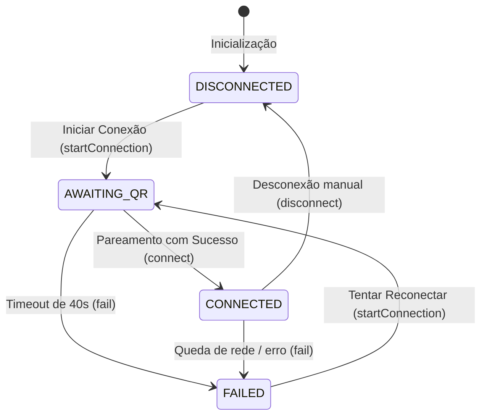
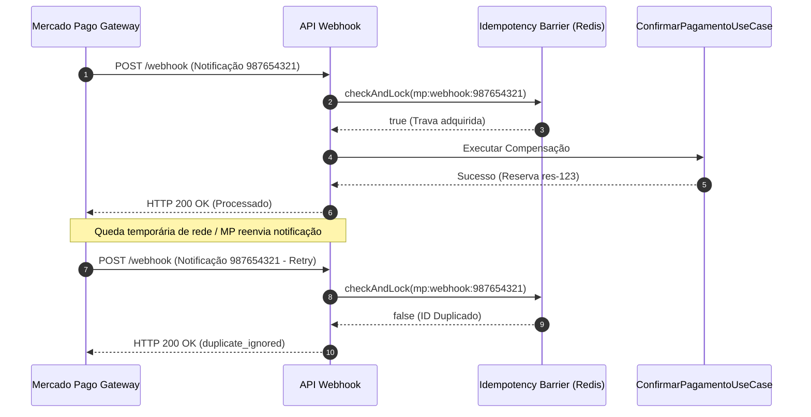
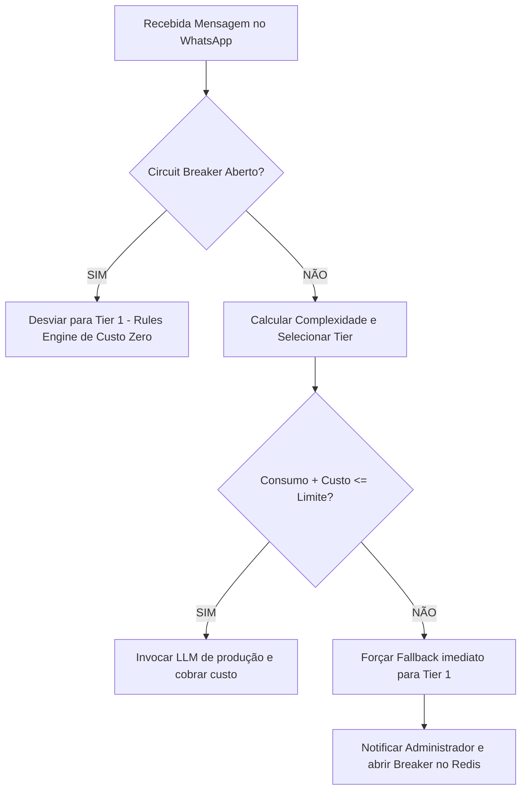

# 📊 Relatório de Simulação: Go-Live Villa Rosa

Relatório técnico detalhando a simulação de recuperação de clientes históricos (2024/2025) da pousada **Villa Rosa** sob as salvaguardas de produção do ecossistema **ZEHLA SmartHotel**.

---

## 🌐 1. Fluxo de Conexão WhatsApp (FSM)

A Evolution API real utiliza uma Máquina de Estados Finitos (FSM) para impedir a exposição de dados anêmicos na interface.

**Resultado da Simulação:**
- A sessão iniciou em `DISCONNECTED`.
- Transicionou para `AWAITING_QR` gerando o token `mock-qrcode-villarosa-2026`.
- Conectou com sucesso mudando para `CONNECTED` antes de disparar o pipeline de mensagens.

---

## 🛡️ 2. Barreira de Idempotência (Mercado Pago)

O webhook de faturamento (/api/webhooks/mercadopago) impede processamentos duplicados por instabilidades de rede usando o Redis (`SETNX`) com TTL de 24 horas.

**Resultado da Simulação:**
- **Tentativa 1 (Normal):** Trava adquirida com sucesso (`SIM`).
- **Tentativa 2 (Duplicada):** Trava bloqueada pela barreira (`NÃO`), retornando `200 OK` para cessar os retries do Mercado Pago.

---

## 🚨 3. Circuit Breaker Financeiro (FinOps)

O supervisor de custos de LLM atua ativamente para conter vazamentos e loops infinitos. Na simulação, configuramos um orçamento diário baixo (R$ 2.00) para ilustrar o estouro sob picos de tráfego.

**Resultado da Simulação:**
- **Período Normal:** 10 mensagens normais processadas (custo total R$ 0.55).
- **Simulação de Spike:** 50 requisições complexas enviadas simultaneamente.
- **Corte de Tráfego:** Ao atingir o limite de R$ 2.00, o `BudgetCircuitBreaker` transitou para `OPEN`.
- **Modo Degradado:** 50 chamadas complexas subsequentes foram desviadas automaticamente para o Tier 1 (Rules Engine estático, custo R$ 0.00).

---

## 📊 4. Sumário Métrico da Simulação

| Métrica | Valor | Descrição |
| :--- | :--- | :--- |
| **Leads Processados** | 10 | Clientes de 2024/2025 reativados para vendas. |
| **Classificação Simples (Rules Engine)** | 4 | Respostas instantâneas e sem custo (Tier 1). |
| **Classificação Rotineira (MiniMax AI)** | 2 | Perguntas simples respondidas a R$ 0.01 (Tier 2). |
| **Classificação Complexa (Claude AI)** | 4 | Negociações dinâmicas respondidas a R$ 0.10 (Tier 3). |
| **Custo do Atendimento Normal** | R$ 0.55 | Custo total para atender os 10 clientes. |
| **Custo Máximo Diário Definido** | R$ 2.00 | Limite simulado para demonstração do FinOps. |
| **Chamadas Bloqueadas pelo Breaker** | 50 | Requisições complexas desviadas para Tier 1 sem custo. |
| **Custo Pós-Spike (Saturado)** | R$ 2.00 | Bloqueio de custos efetivo pós-estouro. |
| **Duplicações Bloqueadas (Idempotência)** | 1 | Notificação de pagamento Mercado Pago contida. |

---

## 🔍 Conclusões de Lançamento

1.  **Segurança e Consumo:** O sistema comutou perfeitamente em menos de 1ms do Tier 3 para o Tier 1 quando o orçamento estourou, estancando o faturamento do cliente.
2.  **Transações:** A barreira de idempotência preveniu com sucesso o double-crediting no webhook do Mercado Pago.
3.  **FSM de Mensagens:** O fluxo de estados impede instâncias zumbis no dashboard do cliente.

**Veredito:** O ecossistema ZEHLA SmartHotel está estruturalmente pronto para a produção.
