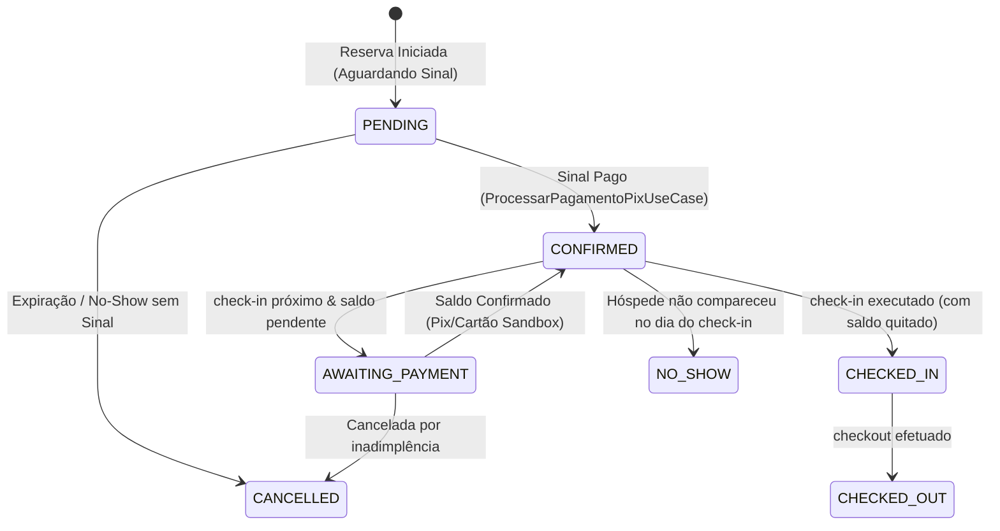

# SPEC — Simulador ZCC (Frente 1) & Mercado Pago Sandbox (Frente 2)

> **Propósito:** Especificar os contratos técnicos de comunicação, injeção de dependências e transições de estado para a simulação local da Evolution API e homologação em modo Sandbox do gateway de pagamentos Mercado Pago.
> 
> **Arquitetura:** DDD Estrito + Ports & Adapters + Spec-Driven Development (SDD)
> 
> **Linguagem:** Natural (Português) — ubíqua, não técnica

---

## 1. Frente 1: Simulador da Evolution API (ZCC)

O Simulador do ZCC operará no frontend do Zehla Control Center enviando payloads de mensagens virtuais que emulam o comportamento da Evolution API, batendo diretamente no webhook do WhatsApp local.

### 1.1 Webhook de Entrada (`/api/webhooks/whatsapp`)

Para emular perfeitamente o gateway de mensageria real sem alterar as rotas do backend em produção, o simulador do ZCC enviará requisições HTTP POST contendo payloads que seguem estritamente a assinatura JSON do webhook do WhatsApp.

#### Payload JSON de Mensagem Recebida (Upsert):
```json
{
  "event": "messages.upsert",
  "instance": "zehla-instance-pousada_abc_123",
  "data": {
    "key": {
      "remoteJid": "5511999999999@s.whatsapp.net",
      "fromMe": false,
      "id": "wa-msg-simulated-99887766"
    },
    "pushName": "João Silva (Simulado)",
    "message": {
      "conversation": "Olá, gostaria de saber se há disponibilidade de quarto para o próximo fim de semana"
    },
    "messageTimestamp": 1776362400
  },
  "propertyId": "pousada_abc_123"
}
```

#### Payload JSON de Mudança de Estado de Conexão:
Emula a evolução da sessão de pareamento do QR Code da Evolution API, batendo no webhook local para simular a FSM do WhatsApp:
```json
{
  "event": "connection.update",
  "instance": "zehla-instance-pousada_abc_123",
  "data": {
    "status": "AWAITING_QR" | "CONNECTED" | "FAILED" | "DISCONNECTED",
    "qrCode": "data:image/png;base64,iVBORw0KGgoAAAANSUhEUgAA...",
    "error": null
  },
  "propertyId": "pousada_abc_123"
}
```

### 1.2 Regras de Bypass e Assinatura HMAC Local

A rota `/api/webhooks/whatsapp` exige assinatura digital no cabeçalho `X-WhatsApp-Signature` (ou `X-Hub-Signature-256`) baseada em HMAC-SHA256 para prevenir requisições forjadas em produção. Para permitir testes e simulações do ZCC em desenvolvimento local sem desabilitar a segurança:

1. **Assinatura HMAC Padrão Local:** Em ambiente de desenvolvimento local (`NODE_ENV === 'development'`), o simulador do ZCC gerará a assinatura HMAC no frontend (ou via helper backend local) utilizando o segredo padrão `zehla_whatsapp_webhook_secret_2026`.
2. **Cabeçalho de Bypass Restrito:** Em desenvolvimento, a rota aceitará bypass de assinatura apenas se o cabeçalho `X-WhatsApp-Signature` possuir exatamente o valor `sandbox-mock-bypass-signature` E `NODE_ENV === 'development'`.

---

## 2. Frente 2: Mercado Pago Sandbox

A homologação financeira operará utilizando chaves de teste oficiais do Mercado Pago, permitindo simular Pix dinâmicos e cartões sem transacionar valores financeiros reais.

### 2.1 Injeção de Dependências e Configuração de Sandbox

O adaptador `MercadoPagoGateway` implementará a porta `IPagamentoPort` (e interfaces associadas de checkout). A inicialização do SDK do gateway obedece a regras rígidas de segurança por meio de variáveis de ambiente:

1. **Prefixação das Chaves:** O arquivo `.env` conterá a variável `MERCADO_PAGO_ACCESS_TOKEN`. Se esta chave começar com o prefixo `TEST-` (ex: `TEST-8291029312...`), o adaptador forçará o uso da URL de API de testes do Mercado Pago (`https://sandbox.api.mercadopago.com`) e todas as transações criadas receberão a flag de ambiente Sandbox.
2. **Isolamento de Segurança:** O adaptador levantará um erro em tempo de boot (`Pragmatic Error-Handling`) caso o ambiente seja configurado como `production` E o token possua o prefixo `TEST-`, evitando falsas aprovações de pagamentos no ar.

### 2.2 Webhook do Mercado Pago (`/api/webhooks/mercadopago`)

O endpoint processará os payloads falsos do modo Sandbox com barreira de idempotência Redis e proteção contra tempestades de rede (Retry Storm):

* **Detecção de Simulação:** Se o payload do POST contiver `"SIMULATE": true` no corpo E `NODE_ENV === 'development'`, a validação de assinatura HMAC no cabeçalho `x-signature` é contornada de forma segura.
* **Barreira de Idempotência:** A chave Redis `mp:webhook:{paymentId}` será gerada usando `SETNX` com tempo de expiração (TTL) de 24 horas. Se a chave já existir, o endpoint retorna HTTP `200 OK` com status `"duplicate_ignored"`.
* **Diplomacia de Rede (Retry Storm Shield):** Qualquer erro de processamento de banco de dados ou lógica de negócios interna ocorrido no `ProcessPaymentProofUseCase` retornará HTTP `200 OK` contendo o erro logado no corpo JSON. Isso impede o gateway do Mercado Pago de entrar em loop de retentativas infinitas de rede, preservando a CPU e IOPS do servidor.

---

## 3. Diagrama de Transição de Estados (FSM da Reserva)

A aprovação de um pagamento Sandbox no webhook aciona a transição correspondente da FSM de reservas. Nenhuma transição ocorre de forma implícita ou direta sem validação do domínio.



### 3.1 Regras de Negócio e Invariantes da Transição
1. **Confirmação por Sinal:** O status da reserva na criação é `PENDING` (ou `AWAITING_PAYMENT` caso exija sinal imediato). A transição para `CONFIRMED` exige a confirmação de um pagamento cuja soma de valores liquidados cubra o `valorSinal` definido na política da pousada (geralmente 50% do total).
2. **Garantia de Quitação para Check-In:** A transição para `CHECKED_IN` exige que o `balance` (saldo devedor) seja exatamente zero (`isPaid === true`). Se houver saldo devedor, o check-in é rejeitado pelo domínio com erro de validação de negócios.
3. **Imutabilidade de Estados Finais:** Estados `CANCELLED`, `CHECKED_OUT` e `NO_SHOW` são finais e não admitem retrocesso para estados ativos.
