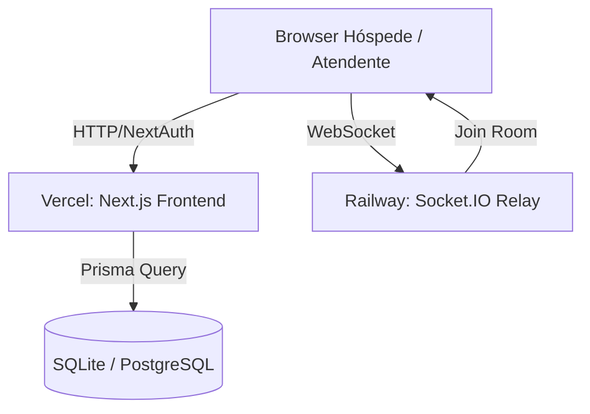

# Guia de Deploy de Staging — ZEHLA SmartHotel

Este documento detalha o procedimento operacional para realizar o deploy do ZEHLA SmartHotel em ambiente de staging (homologação), abrangendo a hospedagem do painel Next.js e o relay Socket.IO.

---

## 🏗️ Arquitetura de Staging

O deploy de staging é dividido em duas partes fundamentais:

1. **Vercel**: Hospeda a aplicação Next.js (Frontend, Command Center DDC/ZCC, e as rotas de API do roteador cognitivo).
2. **Railway**: Hospeda o mini-serviço standalone de Socket.IO Relay (`mini-services/realtime-service`).

---

## 📦 Parte 1: Deploy do Frontend (Vercel)

### 1. Conectar Repositório
Hospede o código no GitHub e conecte o repositório `SmartHotel_Zehla` em uma nova aplicação na dashboard da Vercel.

### 2. Configurar Variáveis de Ambiente (Environment Variables)
Adicione as seguintes variáveis nas configurações do projeto da Vercel:

| Variável | Valor Recomendado (Staging) | Descrição |
|----------|-----------------------------|-----------|
| `DATABASE_URL` | `file:./db/secretaria.db` | Caminho do SQLite. *Nota: Para persistência permanente entre builds na Vercel, recomenda-se conectar a um Postgres externo na nuvem (ex: Railway/Supabase).* |
| `NEXTAUTH_URL` | `https://zehla-staging.vercel.app` | URL pública da sua aplicação na Vercel. |
| `NEXTAUTH_SECRET` | `gerar-segredo-com-openssl-rand-32` | Segredo usado pelo NextAuth para assinar cookies. |
| `MP_ACCESS_TOKEN` | `TEST-xxxxx-seu-token` | Token de credencial do Mercado Pago (modo Sandbox/Teste). |
| `MP_WEBHOOK_URL` | `https://zehla-staging.vercel.app/api/checkout/webhook` | URL pública de callback do webhook de pagamento. |
| `WHATSAPP_WEBHOOK_VERIFY_TOKEN` | `zehla_whatsapp_verify_2024` | Token de verificação configurado no painel da Meta Developers. |

---

## ⚡ Parte 2: Deploy do Relay Realtime (Railway)

O microsserviço de Socket.IO localiza-se na pasta `mini-services/realtime-service`.

### 1. Deploy Standalone
No painel do Railway, selecione **New Project** -> **Deploy from GitHub repository** e aponte para o repositório ZEHLA.

### 2. Configurar a Raiz do Serviço (Root Directory)
Nas configurações de build do Railway, altere o **Root Directory** para:
`mini-services/realtime-service`

### 3. Variáveis de Ambiente
O mini-serviço lê a porta `3005` por padrão. Configure as seguintes variáveis no painel da Railway:

- `PORT`: `3005` (A porta onde o serviço escuta as conexões WebSocket).
- `NODE_ENV`: `production`

O Railway gerará um domínio público (ex: `zehla-realtime.up.railway.app`). Mapeie essa URL no hook cliente `src/lib/use-socket.ts` ou configure regras de Proxy no Next.js.

---

## 💬 Parte 3: Configurando o Webhook do WhatsApp

Para testar o fluxo de mensagens cognitivas de ponta a ponta no staging:

1. Acesse o console [Meta for Developers](https://developers.facebook.com/).
2. Vá em **WhatsApp** -> **Configuration**.
3. Em **Callback URL**, insira:
   `https://zehla-staging.vercel.app/api/webhook-whatsapp`
4. Em **Verify Token**, digite o valor de `WHATSAPP_WEBHOOK_VERIFY_TOKEN` (definido no `.env`).
5. Subscreva nos campos de webhook: **messages**.

---

## 🔍 Validação Pós-Deploy

Uma vez que ambos os serviços estejam no ar:
1. Acesse a Landing Page no endereço da Vercel.
2. Navegue até a tela de login (`/login`) e entre com o tenant demo: `demo@pousada.com.br` / `Demo@123`.
3. Abra a aba de Realtime no ZCC (`/zcc/realtime`) e verifique se o status do Socket.IO indica "Conectado" apontando para o servidor do Railway.
