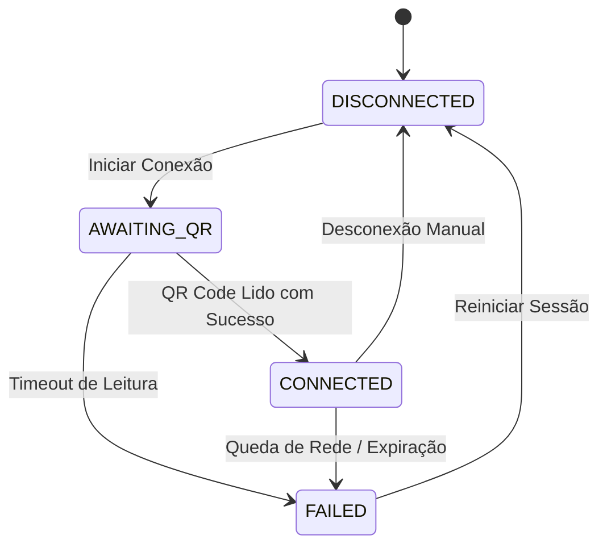

# Plano de Implementação — Próximos Passos de Produção (Go-Live)

Este plano descreve as etapas técnicas de engenharia, os designs lógicos e as alterações de código necessárias para avançar com segurança militar do estágio de calibração para a preparação final do lançamento comercial (**Go-Live**) do **ZEHLA SmartHotel**.

---

## User Review Required

> [!WARNING]
> **Adoção de Sandboxes de Credenciais**: Para a suíte de testes de conciliação financeira do Mercado Pago e da Evolution API, usaremos credenciais fictícias no ambiente de homologação e a configuração local do `.env.local` com o prefixo `TEST-`. Chaves reais de produção só serão injetadas através do cofre de variáveis no deployment (Fly.io).

---

## Lógica e Arquitetura Detalhada

### 1. FSM de Conexão WhatsApp (Domínio Operacional)
A infraestrutura não dita o estado. Modelaremos uma Máquina de Estados Finitos (FSM) rica no Domínio para representar a sessão ativa do WhatsApp. Os estados estritos são:
*   `DISCONNECTED`: Sessão inativa, sem conexão estabelecida.
*   `AWAITING_QR`: Instância gerada, aguardando leitura do QR Code pelo usuário.
*   `CONNECTED`: Canal de comunicação ativo e conectado.
*   `FAILED`: Falha crítica de conexão ou expiração do token.



### 2. Barreira de Idempotência (Mercado Pago Webhook)
Para evitar processamento duplicado de PIX causado por retentativas de webhook após timeouts de rede, criaremos uma barreira de idempotência via Redis com expiração de 24 horas.

```
[Requisição Webhook MP] 
       ⬇
[Verificar HMAC Signature] ➡️ Falha? Retorna 400 Bad Request
       ⬇
[IdempotencyBarrier (Redis)] ➡️ Chave Existente? Retorna 200 OK (Ignora silenciosamente)
       ⬇
[Grava Chave com TTL 24h]
       ⬇
[ProcessarPagamentoPixUseCase] ➡️ Confirma no RoomBoard (Banco Prisma)
```

### 3. FinOps Circuit Breaker (Zelador Autônomo)
O `SelfHealingEngine` (Zelador AI) fará a auditoria ativa do consumo de tokens diário por tenant. Se o consumo atingir **95% do teto diário** (ex: R$ 50/dia), o Zelador disparará um corte de gastos forçado, rebaixando temporariamente a pousada para o Tier 1 (Rules Engine de custo zero).

---

## Proposed Changes

### Componente: Domínio Operacional & Mensageria (WhatsApp FSM)

#### [NEW] [WhatsAppFSM.ts](file:///Users/marciocau/Projetos/zehla-backend/src/domain/operational/models/WhatsAppFSM.ts)
*   Criar enum `WhatsAppState` com os valores: `DISCONNECTED`, `AWAITING_QR`, `CONNECTED`, `FAILED`.
*   Criar entidade `WhatsAppSession` que gerencia a transição de estados validando as invariantes (não permite ir de `DISCONNECTED` diretamente para `CONNECTED` sem passar por `AWAITING_QR`).

#### [NEW] [route.ts](file:///Users/marciocau/Projetos/zehla-backend/src/app/api/zcc/evolution/instances/route.ts)
*   Criar endpoint `GET /api/zcc/evolution/instances` estritamente isolado pelo JWT Guard (`authenticateRequest` extraindo `propertyId`).
*   Construir o `instanceName` dinamicamente como `zehla-instance-${propertyId}`.
*   Invocar o `EvolutionWhatsAppAdapter` para ler o estado da conexão e instanciar a entidade `WhatsAppSession`, retornando o estado exato da FSM e o QR Code se estiver em `AWAITING_QR`.
*   Retornar HTTP `400` se o tenant ID estiver ausente ou incorreto.

#### [MODIFY] [WhatsAppPanel.tsx](file:///Users/marciocau/Projetos/zehla-backend/src/components/dashboard/WhatsAppPanel.tsx)
*   Modificar para interagir com o novo endpoint e reagir dinamicamente a cada estado da FSM (`CONNECTED` exibe status verde, `AWAITING_QR` exibe o QR Code na tela, `DISCONNECTED` / `FAILED` oferecem botão de reconectar).

---

### Componente: Conciliação Financeira (Webhook do Mercado Pago)

#### [NEW] [IdempotencyBarrier.ts](file:///Users/marciocau/Projetos/zehla-backend/src/infrastructure/security/IdempotencyBarrier.ts)
*   Criar a barreira de idempotência utilizando o cliente Redis `redis`.
*   Implementar o método `checkAndLock(key: string, ttlSeconds: number): Promise<boolean>` que executa atomicamente um comando `SETNX` no Redis. Retorna `true` se a trava foi adquirida e `false` caso contrário.

#### [NEW] [route.ts](file:///Users/marciocau/Projetos/zehla-backend/src/app/api/webhooks/mercadopago/route.ts)
*   Implementar a rota HTTP POST `/api/webhooks/mercadopago`.
*   Validar a assinatura do Mercado Pago via HMAC usando `MERCADO_PAGO_WEBHOOK_SECRET` do `.env`. Se falhar, retornar `400 Bad Request`.
*   Extrair o ID único da transação (ex: `action_id` ou `payment_id`).
*   Verificar o `IdempotencyBarrier` com a chave `mp:webhook:${paymentId}`. Se a chave já existir, interromper e retornar `200 OK` (evitando retries desnecessários do gateway).
*   Chamar o `ProcessPaymentProofUseCase` em caso de sucesso na validação. Em erros de banco internos, retornar `200 OK` com flag de erro registrado em logs para blindar o webhook de loops infinitos de retentativa do gateway.

---

### Componente: Autocorreção & FinOps (Zelador Autônomo)

#### [MODIFY] [self-healing-engine.ts](file:///Users/marciocau/Projetos/zehla-backend/src/lib/ml/self-healing-engine.ts)
*   Atualizar o método `diagnoseAndHeal` para invocar a verificação de consumo de tokens diário por tenant.
*   Comparar o uso diário retornado pelo `BudgetTracker` contra o limite diário configurado para a pousada.
*   Se o consumo atingir >= 95% do teto, escrever uma chave de bloqueio no Redis (`config:tenant:${tenantId}:force_tier_1`, com validade de 24 horas) e notificar o terminal através de `CognitiveTerminal.error`.
*   Ajustar a verificação de erros do Prisma e conexões para mapear corretamente o schema de `SystemLog`.

#### [NEW] [scheduler.ts](file:///Users/marciocau/Projetos/zehla-backend/src/lib/ml/scheduler.ts)
*   Criar rotinas recorrentes de agendamento usando repeatable jobs do BullMQ de forma isolada, rodando o diagnóstico `HEAL_SYSTEM` a cada 5 minutos e verificando trials `CHECK_TRIALS` a cada 1 hora.

---

## Verification Plan

### Automated Tests
*   Criar suíte de testes unitários para a FSM do WhatsApp:
    ```bash
    pnpm vitest run src/__tests__/evolution/WhatsAppFSM.test.ts
    ```
*   Criar testes para a barreira de idempotência:
    ```bash
    pnpm vitest run src/__tests__/security/IdempotencyBarrier.test.ts
    ```
*   Validar webhook do Mercado Pago simulando retries duplicados:
    ```bash
    pnpm vitest run src/__tests__/webhooks/mercadopago.test.ts
    ```

### Manual Verification
1.  **FSM Reactivity**: Acessar o painel no dashboard do ZCC e verificar a transição visual conforme o estado retornado pela Evolution API.
2.  **Idempotency Execution**: Disparar manualmente duas chamadas HTTP POST idênticas para `/api/webhooks/mercadopago` e confirmar no terminal que apenas uma transação foi registrada no banco de dados.
3.  **Circuit Breaker Trigger**: Simular faturamento alto de tokens de IA para um tenant de teste e verificar se o Zelador ativou autonomamente a trava de Tier 1 no Redis.
