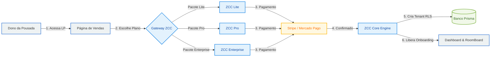
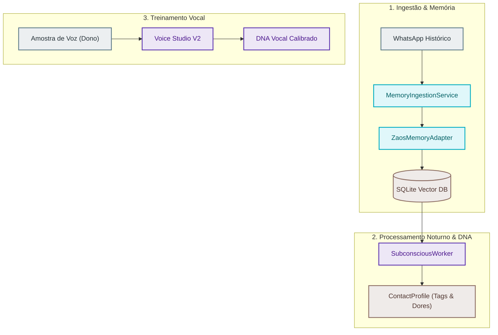
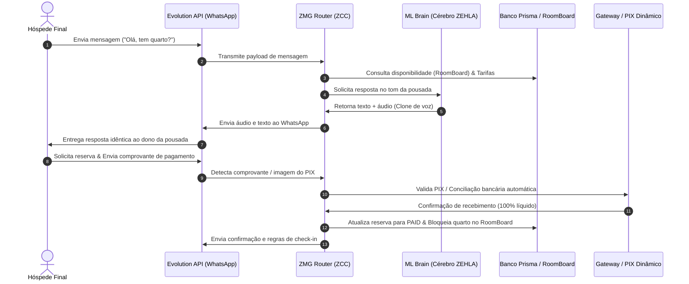
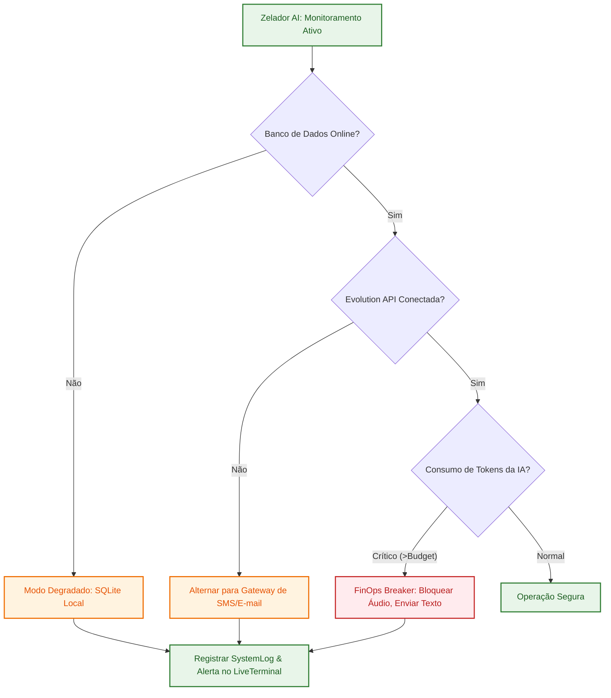

# ⚙️ ZEHLA: Blueprint Operacional e Fluxo Cognitivo de Ponta a Ponta

Este documento é o guia definitivo de engenharia de fluxos e predições do ecossistema **ZEHLA SmartHotel**. Ele demonstra o comportamento e a integração de todas as camadas do sistema quando estiverem operando na "vida real".

---

## 🔄 1. Diagramas de Fluxo Operacional (Ponta a Ponta)

Para visualizar com clareza o funcionamento sem cruzamento de linhas ou layouts confusos, dividimos a operação do ecossistema ZEHLA em três fluxos lógicos e complementares:

### Fluxo A: Funil de Vendas e Ativação do Dono da Pousada
Este fluxo descreve como o Dono da Pousada assina o plano, realiza a configuração de contas e acessa o dashboard:



### Fluxo B: Pipeline de Aprendizado (ML Brain & RAG)
Este fluxo mostra como o cérebro ZEHLA aprende a partir das conversas históricas das **6 Pousadas Amigas** e calibra o tom de voz:



### Fluxo C: Atendimento e Conversão do Hóspede na "Vida Real"
Este diagrama detalha a sequência interativa entre o hóspede, a IA com voz clonada e a conciliação financeira:



---

## 📁 2. Mapeamento de Fases e Lógica de Operação

### Fase A: Conversão & Ingestão Financeira (Dono da Pousada)
1. **Escolha de Pacotes:** O Dono da Pousada seleciona entre os planos *LITE, PRO ou ENTERPRISE*. Cada plano determina limites de:
   * **Quartos cadastrados** (até 10 quartos no LITE, ilimitado no PRO).
   * **Quota mensal de tokens de voz** para síntese de áudio (Zehla Voice Budget).
   * **Acesso a canais de fallback** (SMS e E-mail integrados no ZMG).
2. **Processamento Financeiro & Contas de Banco:** O ZCC gerencia o recebimento da assinatura do cliente:
   * A assinatura é criada via gateway de pagamento, gerando um `Invoice` e registrando as contas bancárias da pousada.
   * O sistema realiza a conciliação bancária automática via Webhook para registrar depósitos diretos, liberando a chave do tenant imediatamente após a detecção de confirmação.

---

### Fase B: Dashboard & Onboarding Integrado
Uma vez aprovado o pagamento, o Dono da Pousada é direcionado para a bancada digital do ZCC, onde os seguintes dados são configurados e estruturados:

| Aba do Dashboard | Componente Técnico Responsável | Ação Operacional |
| :--- | :--- | :--- |
| **Mapa de Quartos** | [RoomBoard](file:///Users/marciocau/Projetos/zehla-backend/src/components/dashboard/RoomBoard.tsx) | Visualização e manipulação visual das reservas nos quartos. |
| **Onboarding Wizard** | [OnboardingWizard](file:///Users/marciocau/Projetos/zehla-backend/src/components/onboarding/OnboardingWizard.tsx) | Fluxo guiado para configurar dados de endereço, regras locais e tarifas base. |
| **Terminal de Logs** | [LiveTerminal](file:///Users/marciocau/Projetos/zehla-backend/src/components/client/LiveTerminal.tsx) | Tela de monitoramento em tempo real que exibe os pensamentos e decisões tomadas pelos agentes. |
| **Voice Studio** | [VoiceStudioV2](file:///Users/marciocau/Projetos/zehla-backend/src/components/VoiceStudio/VoiceStudioV2.tsx) | Upload e treinamento de amostras de voz para gerar o DNA vocal da pousada. |

---

### Fase C: O Aprendizado Contínuo (ML Brain & RAG)
Para que a IA aja de forma preditiva, ela precisa aprender os comportamentos dos hóspedes específicos de cada pousada. Isso é feito por meio de dois ciclos paralelos:

```
[Fluxo de Aprendizado ZEHLA]
Histórico WhatsApp (6 Pousadas Amigas) 
       ⬇
Ingestão RAG (MemoryIngestionService) ➡️ Criação da Árvore Semântica de Memória
       ⬇
Ciclo Subconsciente (SubconsciousWorker) ➡️ Calibração de Intenções e Modelos Locais
       ⬇
Geração Preditiva (Z-Router) ➡️ Resposta Personalizada e Conversão de Vendas
```

*   **Ingestão de Conversas (RAG):** As mensagens extraídas do WhatsApp são quebradas em trechos semânticos, vetorizadas e gravadas na tabela `ContactProfile` e na memória vetorial local (`ZaosMemoryAdapter`).
*   **Ciclo Subconsciente:** Executado assincronamente pelo [SubconsciousWorker](file:///Users/marciocau/Projetos/zehla-backend/src/lib/ml/subconscious-worker.ts). Ele processa e sumariza interações antigas durante a madrugada, alimentando o perfil do hóspede com tags comportamentais (ex: *Hóspede recorrente, prefere check-in tardio, pede desconto*).

---

## 🔮 3. Inteligência Preditiva e Prevenção de Falhas (Vida Real)

Para operar de forma sustentável e resiliente antes mesmo que problemas ocorram, o ZEHLA implementa os seguintes mecanismos preditivos:

### 1. Detecção Precoce de Gargalos e Cancelamentos (Anomalies & RevPAR)
O cérebro ZEHLA analisa em tempo real os dados financeiros e reservas cadastradas:
*   **Zé-Analyst (Revenue):** Calcula métricas de ocupação futura, ADR (Diária Média) e RevPAR (Receita por Quarto Disponível). Se a taxa de ocupação estimada para o próximo feriado estiver 20% abaixo da média histórica regional, o sistema alerta o Dono da Pousada no painel e sugere automaticamente uma campanha reativa (Sales Farming) com cupons de desconto inteligentes.

### 2. Defesa Ativa e Correção Autônoma (Self-Healing)
Caso algum componente essencial perca a integridade em produção, o sistema executa o protocolo de autocorreção sem interromper a operação:



*   **Modo Degradado Automático:** Conforme codificado na resiliência do `PosteriorRepository`, caso o banco de dados principal sofra oscilação de conexão, a inteligência degrada automaticamente para o cache SQLite local in-memory. Os dados continuam sendo gravados localmente e são sincronizados de volta assim que a conexão principal é restabelecida.
*   **FinOps Breaker:** Se o consumo de créditos de síntese de voz (áudio) subir exponencialmente acima do budget configurado pelo cliente em menos de 1 hora, o sistema bloqueia temporariamente a geração de áudios e alterna o ZMG para responder em texto, prevenindo faturas de API astronômicas por loops infinitos de mensagens.

---

> [!IMPORTANT]
> **PREPARAÇÃO PARA A VIDA REAL:** O alinhamento perfeito de todas essas camadas garante que o ZEHLA não seja apenas um chatbot passivo, mas um **Sistema Operacional de Hospitalidade**. Ele prevê desistências, recupera faturamento de leads frios e garante resiliência técnica militar contra oscilações de rede locais.
