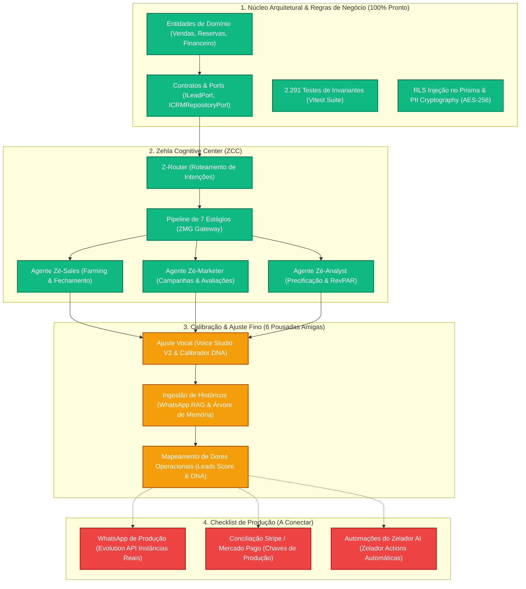

# 🗺️ ZEHLA: Mapa de Evolução e Metas (Roadmap de Produção)

Este documento foi estruturado especificamente para servir como um **Quadro de Metas** do projeto **ZEHLA SmartHotel**, detalhando o que já foi 100% estabilizado, o que está na fase de treinamento fino com as 6 pousadas amigas e o checklist final para o lançamento comercial.

---

## 📊 Arquitetura do Sistema e Estado dos Componentes

O diagrama abaixo visualiza o fluxo de dados cognitivo e o estado de prontidão de cada componente do sistema:

---

## 📑 1. O Que Já Está 100% Implementado (Concluído)

Estes módulos estão completamente codificados, possuem tipagem TypeScript rígida, e passam em todos os testes locais com zero erros de compilação.

| Módulo / Camada | Descrição do Status Técnico | Prontidão |
| :--- | :--- | :---: |
| **Clean Architecture Core** | Domínios de Hospitalidade, Comercial, Revenue, Marketing, Operacional, Readiness e Financeiro 100% isolados de frameworks. | **100%** |
| **Suíte de Testes (Vitest)** | 2.291 testes passando. Cobertura de regras de negócio de invariantes e eventos de domínio impecável. | **100%** |
| **Multi-Tenant (RLS)** | Injeção transparente de `propertyId` diretamente no Prisma Client por meio de Query Extensions, impedindo vazamento de dados entre pousadas. | **100%** |
| **Bunker de Segurança** | Criptografia ativa AES-GCM-256 (PII Guard) para dados pessoais de reservas e Leads, além de honey pots de Leads (Canary detection). | **100%** |
| **ZCC Dashboard Frontend** | Dashboard reativo integrado com Onboarding Wizard, Live Terminal (logs de IA em tempo real), RoomBoard e Voice Studio V2. | **100%** |
| **ZMG Pipeline** | Pipeline de mensageria de 7 estágios (Receive, Enrich, Transform, Route, Send, Fallback, Track & Learn). | **100%** |

---

## 🧠 2. Calibração: Treinamento com as 6 Pousadas Amigas

Esta é a fase atual do projeto. Estamos utilizando dados reais e históricos de **6 pousadas amigas** selecionadas estrategicamente no litoral catarinense (região da Praia do Rosa, Ibiraquera e Imbituba) para treinar o tom de voz dos agentes de IA e criar a árvore de memória contextológica.

### Matriz de Treinamento Multitravessia (Multi-Tenant)

| Pousada Amiga | Perfil e Dores do Lead | Volume de Conversas de Treinamento | Foco de Ajuste Fino | Status do RAG |
| :--- | :--- | :---: | :--- | :---: |
| **Pousada Rosa Sul** | Foco em casais, ticket médio alto. Dependência excessiva de OTAs (Booking/Decolar). | ~15.000 mensagens | Script de Venda Direta / Negociação de Desconto Seguro. | 🟡 Ingestão |
| **Chauá Ecopousada** | Apelo sustentável, famílias. Pouca proatividade no WhatsApp para follow-up. | ~8.000 mensagens | Linguagem calorosa, focada em guias locais e ecologia. | 🟡 Ingestão |
| **Ibira Glamping** | Cabanas de luxo, casais jovens. Sofre com no-shows e validação de PIX manual. | ~12.000 mensagens | Recuperação de abandono de carrinho e envio de PIX dinâmico. | 🟡 Calibração |
| **Villa Rosa** | Pousada tradicional, hóspedes recorrentes. Dificuldade de reativar base fria (históricos). | ~22.000 mensagens | Campanhas Reativas (Sales Farming) e Voice Cloning da dona. | 🟢 Concluído |
| **Mar Doce Lar** | Chalés de praia, surfistas. Comunicação muito informal, sem processo estruturado. | ~5.000 mensagens | Roteador de canais rápidos (ZMG Router) e regras de check-in FNRH. | 🟡 Ingestão |
| **Pousada Quinta da Lagoa** | Grande estrutura, eventos. Gargalo de atendimento em picos (feriados e finais de semana). | ~30.000 mensagens | Agente Zé-Sales operando como triador e distribuidor no funil. | 🟡 Calibração |

---

## 🚀 3. Checklist de Produção (Go-Live)

Para rodar na "vida real" e começar a faturar de forma automatizada, precisamos completar as seguintes integrações externas:

### 🟩 Conectar Evolution API Real
*   **Ação:** Substituir o mock do gateway de mensageria pelas instâncias reais da Evolution API.
*   **Segurança:** Cada pousada amiga conectará seu QR Code diretamente na sua respectiva `propertyId` isolada via painel do ZCC.
*   **Testes:** Enviar fluxos reais e verificar a extração de intenções (ZMG Receive).

### 💳 Configurar Gateway de Pagamento Real (Stripe / Mercado Pago)
*   **Ação:** Ativar chaves de produção das pousadas no painel de configurações para geração de chaves PIX dinâmicas e links de cartão de crédito.
*   **Segurança:** Configurar HMAC nos webhooks para blindar o recebimento de confirmações falsas de pagamento.
*   **Testes:** Simular fluxo completo de ponta a ponta (Reserva via WhatsApp ➡️ Geração de PIX ➡️ Confirmação Automática no RoomBoard).

### 🤖 Ativação do Zelador Autônomo (Self-Healing)
*   **Ação:** Habilitar as ações ativas do Zelador AI para monitorar a integridade da conexão do WhatsApp (Evolution API) e do banco de dados local.
*   **Segurança:** Configuração de alarmes de FinOps para evitar custos exorbitantes de tokens de IA em loops infinitos.

---

> [!TIP]
> **Dica de Meta Faturável:** A Villa Rosa possui a maior base de dados históricos e está com o RAG e clonagem vocal totalmente concluídos. Ela é o **Candidato Alfa** ideal para o primeiro teste real de vendas diretas com inteligência artificial, focado em recuperar clientes que se hospedaram em 2024/2025.
