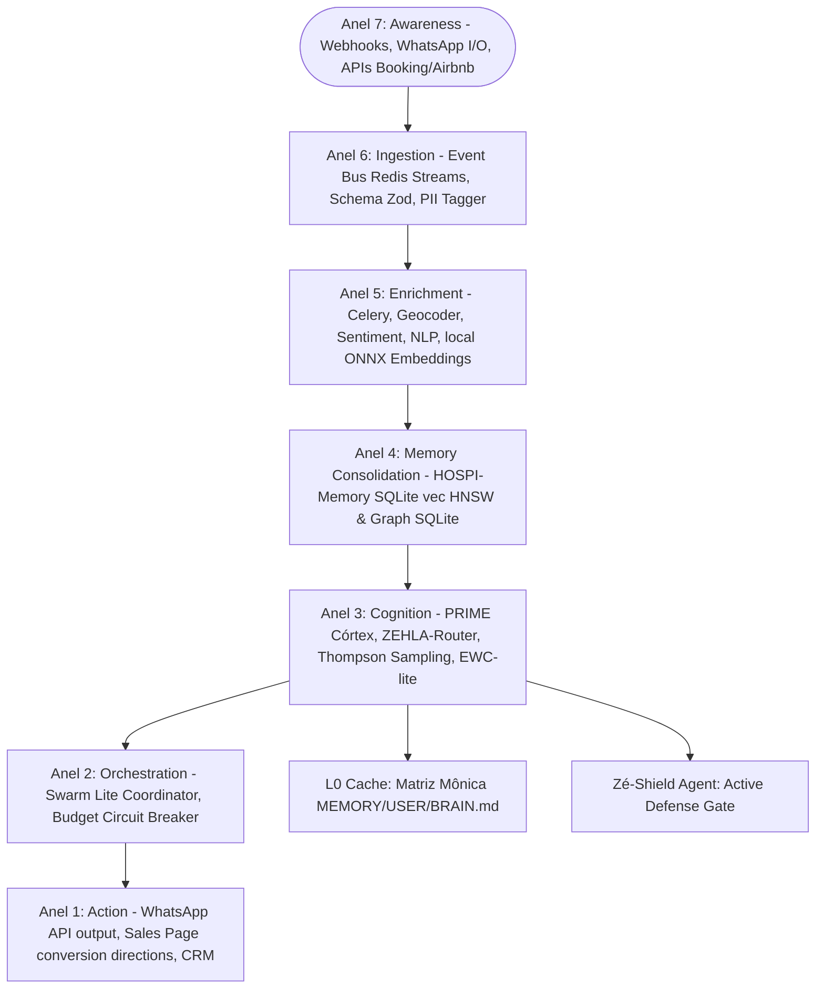
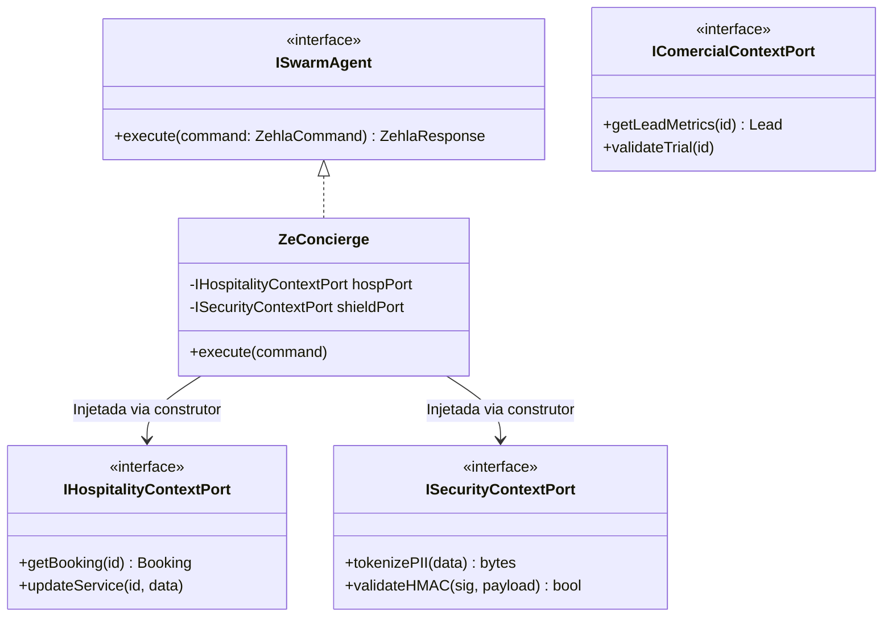

# Plano de Implementação Mestre: ZEHLA PRIME (ZAOS-PRIME) - Secure Hexagonal Design

Este documento especifica a arquitetura definitiva e o plano de implantação do **ZEHLA PRIME (ZAOS-PRIME)**. A partir desta evolução, o cérebro assume a **Centralidade Absoluta** como o próprio organismo vivo do projeto. Todas as interfaces, canais de I/O (WhatsApp, Web Chat, Booking.com), CRM, páginas de conversão de vendas e rotinas de segurança tornam-se extensões periféricas (membros) orquestradas por este centro nervoso central.

---

## 1. Análise do Vetor de Intrusão & Modelagem do Ataque

### ⚠️ A Falha Catastrófica
A vulnerabilidade principal reside no protocolo de comunicação base do ZEHLA PRIME (**ZCP - Zehla Command Protocol**). As especificações anteriores detalhavam as assinaturas e tipos de entradas e saídas (como `HostCommandInputDTO` e `ConciergeMessageInputDTO`), mas falhavam em exigir a obrigatoriedade de autenticação **Machine-to-Machine (M2M)** robusta.
Adicionalmente, os mecanismos de "Budget Circuit Breaker" ignoravam a concorrência assíncrona inerente à execução de agentes paralelos, deixando o ecossistema severamente exposto a ataques temporais.

### 🛠️ Modelagem do Ataque (Offensive Perspective)
Um **Meta-Attacker** executa a exploração através do seguinte fluxo ofensivo coordenado:
1. **Injeção de Payload:** Injeta um payload de Prompt Injection envenenado no canal do WhatsApp atendido pelo **Zé-Concierge (Hermes)**.
2. **Manipulação do Hermes:** O Zé-Concierge, agora sob controle do atacante, é instruído a desviar de suas funções de hospitalidade.
3. **Movimentação Lateral:** Sob influência, o Zé-Concierge dispara um DTO forjado via ZCP ordenando ao **Zé-Host** que libere acessos críticos ou execute comandos operacionais sensíveis via **Zé-Ops**.
4. **Bypass de Confiança:** Como o ZCP anterior assumia implicitamente que mensagens originadas de componentes internos da rede eram confiáveis, o sistema aceita e processa o comando forjado.
5. **Ataque Temporal (TOCTOU):** Simultaneamente, o atacante envia uma tempestade de requisições de IA paralelas. Aproveitando-se de uma falha de *Time of Check to Time of Use* no controle de faturamento, ele faz o sistema consultar o saldo antes de debitar concorrentemente, estourando o saldo financeiro diário por ordens de magnitude. Isso resulta em uma **Negação de Serviço Financeira (FDoS)**, esgotando o orçamento do hotel e paralisando a pousada.

---

## 2. A Metáfora Biológica & As 7 Camadas do PRIME

A arquitetura do ZEHLA PRIME organiza a informação em **7 Anéis de Consciência** concêntricos:



---

## 3. Os 7 Agentes do Swarm Lite (Ports & Adapters Architecture)

Para mitigar a complexidade e impedir o surgimento de "God Classes", aplicamos o **Princípio da Responsabilidade Única (SRP) de forma extrema**.

### ⚡ Regra de Ouro Arquitetural
Nenhum agente tem permissão para invocar conexões com o banco de dados (SQLite/PrismaClient), manipular chaves brutas de conexões ou instanciar clientes HTTP diretamente. **Todos os agentes comunicam-se via ZCP (Zehla Command Protocol) e operam estritamente sob injeção de dependência de interfaces (Ports) no construtor.**



---

### 3.1 Zé-Host (Supremo Coordenador)
*   **Função no Organismo:** Córtex executivo - recebe todas as demandas da pousada, planeja tarefas complexas, delega e consolida os resultados. Gerencia os ciclos do *Ralph Loop*.
*   **Papel Técnico:** Orquestrador principal das rotinas agênticas e controle de metas persistentes.
*   **RESTRIÇÃO ESTRITA:** É terminantemente proibido de persistir dados diretamente nos bancos de dados, escrever nos arquivos de memória ou realizar chamadas externas de rede. Ele só orquestra os subagentes via mensagens assíncronas do ZCP.
*   **PORTS CONSUMIDAS:**
    *   `IOperationalContextPort`: Para criar, ler e monitorar o status de tarefas, checklists e filas de execução.
    *   `ISecurityContextPort`: Para verificar os budgets de IA e validar os tokens de autorização de metas.
*   **ZCP DTO:**
    *   **Input (`HostCommandInputDTO` que herda de `SecureZCPBaseDTO`):**
        ```json
        {
          "tenant_id": "string (RLS Scope)",
          "agent_signature": "string (HMAC SHA-256)",
          "goal_id": "string (UUIDv7)",
          "objective": "string (meta do hoteleiro)",
          "max_turns": "number",
          "budget_limit": "number"
        }
        ```
    *   **Output (`HostCommandOutputDTO`):**
        ```json
        {
          "goal_id": "string",
          "status": "string (completed | failed)",
          "steps_executed": "array of strings",
          "final_report": "string (insights consolidados)",
          "total_cost": "number"
        }
        ```

---

### 3.2 Zé-Concierge (Hermes)
*   **Função no Organismo:** Boca do cérebro - realiza o atendimento ao cliente, responde WhatsApp e atua no suporte N1 das pousadas.
*   **Papel Técnico:** Interface de NLP dialógica focada em hospitalidade e esclarecimento de dúvidas.
*   **RESTRIÇÃO ESTRITA:** É proibido de acessar o inventário operacional da pousada diretamente, cadastrar check-ins físicos sem validação ou alterar políticas do sistema de faturamento.
*   **PORTS CONSUMIDAS:**
    *   `IHospitalityContextPort`: Para ler regras de FAQs, serviços e políticas de quartos cadastrados.
    *   `IMarketingContextPort`: Para realizar análise de sentimentos e catalogar feedback dos diálogos.
*   **ZCP DTO:**
    *   **Input (`ConciergeMessageInputDTO` que herda de `SecureZCPBaseDTO`):**
        ```json
        {
          "tenant_id": "string (RLS Scope)",
          "agent_signature": "string (HMAC SHA-256)",
          "message_id": "string (UUIDv7)",
          "guest_id": "string",
          "raw_text": "string (mensagem tokenizada recebida)",
          "channel": "string (whatsapp | web)"
        }
        ```
    *   **Output (`ConciergeResponseOutputDTO`):**
        ```json
        {
          "response_id": "string",
          "response_text": "string (texto estruturado de resposta)",
          "confidence_score": "number (0.0-1.0)",
          "needs_escalation": "boolean",
          "suggested_upsell_id": "string | null"
        }
        ```

---

### 3.3 Zé-Analyst (Athena)
*   **Função no Organismo:** Inteligência e Raciocínio - analisa taxas de diária média (ADR), ocupação histórica, dados sazonais e precificação dinâmica.
*   **Papel Técnico:** Yield manager e motor preditivo de receitas e tendências locais de hospitalidade.
*   **RESTRIÇÃO ESTRITA:** É proibido de disparar mensagens para hóspedes, gerar posts criativos ou ler segredos/chaves de API descriptografadas.
*   **PORTS CONSUMIDAS:**
    *   `IHospitalityContextPort`: Para extrair taxas de ocupação, diárias aplicadas e inventário de reservas.
    *   `IMarketingContextPort`: Para analisar o impacto financeiro do sentimento de críticas e notas recebidas.
*   **ZCP DTO:**
    *   **Input (`AnalystPricingInputDTO` que herda de `SecureZCPBaseDTO`):**
        ```json
        {
          "tenant_id": "string (RLS Scope)",
          "agent_signature": "string (HMAC SHA-256)",
          "pousada_id": "string",
          "target_month": "string (YYYY-MM)",
          "desconto_maximo": "number",
          "include_market_competitors": "boolean"
        }
        ```
    *   **Output (`AnalystPricingOutputDTO`):**
        ```json
        {
          "recommended_adr": "number (diária ideal em R$)",
          "estimated_occupancy": "number (0.0-1.0)",
          "pricing_matrix": "object (valores por suíte)",
          "rationale": "string (fundamentação em sazonalidade)"
        }
        ```

---

### 3.4 Zé-Marketer (Eris)
*   **Função no Organismo:** Criatividade e Expressão - gera copys, campanhas de e-mail, responde a avaliações (Booking/Google) e planeja calendários de postagens.
*   **Papel Técnico:** Gestor de mídias e copywriting persuasivo de hospitalidade.
*   **RESTRIÇÃO ESTRITA:** É terminantemente proibido de acessar as chaves de recebimento financeiro ou cadastrar novos leads diretamente no CRM sem o scanner de segurança.
*   **PORTS CONSUMIDAS:**
    *   `IMarketingContextPort`: Para ler e gravar campanhas, notas de reviews e posts do calendário.
    *   `IComercialContextPort`: Para ler métricas de funil de conversão agregadas de leads.
*   **ZCP DTO:**
    *   **Input (`MarketerContentInputDTO` que herda de `SecureZCPBaseDTO`):**
        ```json
        {
          "tenant_id": "string (RLS Scope)",
          "agent_signature": "string (HMAC SHA-256)",
          "pousada_id": "string",
          "content_type": "string (social_post | email_campaign | review_reply)",
          "source_data": "object (dados brutos da avaliação ou da campanha)",
          "tone_override": "string"
        }
        ```
    *   **Output (`MarketerContentOutputDTO`):**
        ```json
        {
          "generated_text": "string (copy polido)",
          "suggested_channels": "array of strings",
          "sentiment_score": "number (-1.0 a 1.0)",
          "campaign_id": "string | null"
        }
        ```

---

### 3.5 Zé-Ops (Hephaestus)
*   **Função no Organismo:** Tronco vital - monitora o ecossistema, coordena SLAs de manutenção de quartos e integrações de terceiros.
*   **Papel Técnico:** Gestor de infraestrutura, logs de sistema e integridade de chamadas.
*   **RESTRIÇÃO ESTRITA:** É proibido de gerar copys criativos ou alterar preços por conta própria. Proibido de acessar dados PII originais (só acessa dados mascarados).
*   **PORTS CONSUMIDAS:**
    *   `IOperationalContextPort`: Para interagir com ordens de serviços, rotinas de staff e contatos de fornecedores.
    *   `ISecurityContextPort`: Para notificar e arquivar logs de incidentes de infraestrutura.
*   **ZCP DTO:**
    *   **Input (`OpsJobInputDTO` que herda de `SecureZCPBaseDTO`):**
        ```json
        {
          "tenant_id": "string (RLS Scope)",
          "agent_signature": "string (HMAC SHA-256)",
          "task_id": "string (UUIDv7)",
          "action_type": "string (check_api | trigger_maintenance | health_scan)",
          "target_resource": "string (quarto | webhook_endpoint)"
        }
        ```
    *   **Output (`OpsJobOutputDTO`):**
        ```json
        {
          "completed": "boolean",
          "execution_log": "string",
          "duration_ms": "number",
          "needs_human_escalation": "boolean"
        }
        ```

---

### 3.6 Zé-Sales (Apollo/Convert)
*   **Função no Organismo:** Sistema límbico comercial - focado em converter trials de pousadas em planos pagos, qualificar leads e instruir Landing Pages.
*   **Papel Técnico:** Otimizador de conversão e scoring automatizado de leads no SmartHotel.
*   **RESTRIÇÃO ESTRITA:** É proibido de responder WhatsApp de suporte ao hóspede (N1) ou alterar dados de inventário físico dos hotéis.
*   **PORTS CONSUMIDAS:**
    *   `IComercialContextPort`: Para gerenciar leads, assinaturas, trials, faturamento e rastrear acessos da landing page.
    *   `IMarketingContextPort`: Para puxar o engajamento e métricas de campanhas ativas.
*   **ZCP DTO:**
    *   **Input (`SalesLeadInputDTO` que herda de `SecureZCPBaseDTO`):**
        ```json
        {
          "tenant_id": "string (RLS Scope)",
          "agent_signature": "string (HMAC SHA-256)",
          "lead_id": "string (UUIDv7)",
          "pousada_id": "string",
          "enrichment_sources": "array of strings"
        }
        ```
    *   **Output (`SalesActionOutputDTO`):**
        ```json
        {
          "lead_score": "number (0-100)",
          "landing_page_variant": "string (A / B / C)",
          "suggested_outreach": "string (whatsapp_intro | email_nurture)",
          "conversion_probability": "number"
        }
        ```

---

### 3.7 Zé-Shield (SecMesh Guard)
*   **Função no Organismo:** Sistema Imunológico - opera a defesa cibernética ativa do cérebro ZEHLA PRIME.
*   **Papel Técnico:** Validador e fiscalizador de segurança a nível de código de domínio e transação.
*   **RESTRIÇÃO ESTRITA:** É proibido de tomar decisões de hospitalidade, alterar configurações comerciais das pousadas ou responder verbalmente a hóspedes.
*   **PORTS CONSUMIDAS:**
    *   `ISecurityContextPort`: Para tokenizar dados sensíveis no PII Scanner (ZDR), validar assinaturas HMAC de Pix, monitorar acessos a Honey-Nodes e policiar algoritmos JWT.
*   **ZCP DTO:**
    *   **Input (`ShieldSecurityCheckInputDTO`):**
        ```json
        {
          "tenant_id": "string (RLS Scope)",
          "agent_signature": "string (HMAC SHA-256)",
          "check_type": "string (pii_scan | hmac_check | jwt_gate | canary_alert)",
          "raw_payload": "bytes",
          "metadata": "object (headers, tokens ou assinaturas recebidas)",
          "pousada_id": "string"
        }
        ```
    *   **Output (`ShieldSecurityCheckOutputDTO`):**
        ```json
        {
          "is_safe": "boolean",
          "sanitized_payload": "bytes",
          "threat_detected": "boolean",
          "incident_level": "string (info | warning | critical)",
          "mitigation_action": "string (block | pass | alert)"
        }
        ```

---

## 4. Os 5 Bounded Contexts (DDD SecMesh)

O domínio do ZEHLA PRIME é segmentado em Bounded Contexts para manter o isolamento de dados:
1. **Hospitalidade Context:** Entidades Hóspede, Quarto, Reserva, Serviço, Feedback. Responsável por personalização de estadias e upselling de SPA/passeios. Exprime a interface `IHospitalityContextPort`.
2. **Comercial Context:** Entidades Lead, Proposta, Pacote, Pagamento, Conversão. Gerencia a base de leads e instrui as páginas de venda. Exprime a interface `IComercialContextPort`.
3. **Operacional Context:** Entidades Tarefa, Manutenção, Staff, Fornecedor, Checklist, SLA. Garante SLAs de reparo e escalas. Exprime a interface `IOperationalContextPort`.
4. **Segurança Context:** Entidades ThreatEvent, AuditLog, CanaryNode, SessionToken, EncryptionKey. Camada ativa de proteção. Exprime a interface `ISecurityContextPort`.
5. **Marketing Context:** Entidades Campanha, Conteúdo, Review, Post, Métrica. Analisa sentimentos e responde avaliações. Exprime a interface `IMarketingContextPort`.

---

## 5. Protocolo de Hardening Ativo (SecMesh-Guardian Zero-Trust)

### 5.1 Blindagem do ZCP (Zero-Trust Agent2Agent Protocol)
Nenhum subagente do ZEHLA PRIME processará ou aceitará comandos de outro agente sem que a assinatura de locatário (M2M) seja validada criptograficamente em tempo constante, impedindo movimentações laterais decorrentes de Prompt Injections ou comprometimentos locais.

```python
# backend/core/domain/zcp_protocol.py
import hmac
import gc
import logging
from pydantic import BaseModel, Field, field_validator
from fastapi import HTTPException

logger = logging.getLogger("SECMESH_GUARDIAN_ZCP")
ZCP_SECRET_KEY = b"injecao_dinamica_via_tmpfs" # Nunca usar .env

class SecureZCPBaseDTO(BaseModel):
    """
    Todo DTO (ex: ConciergeMessageInputDTO, HostCommandInputDTO) DEVE herdar desta classe.
    Garante isolamento de locatário (RLS) e prevenção de Goal Hijack entre agentes.
    """
    tenant_id: str = Field(..., description="ID criptográfico da pousada")
    agent_signature: str = Field(..., description="HMAC SHA-256 do payload")
    
    @field_validator('agent_signature')
    def validate_agent_trust(cls, v, info):
        # Validação matemática de tempo constante
        payload_str = str(info.data.get('tenant_id'))
        expected_mac = hmac.new(ZCP_SECRET_KEY, payload_str.encode(), digestmod='sha256').hexdigest()
        
        if not hmac.compare_digest(expected_mac, v):
            logger.critical("🚨 INTRUSÃO: Tentativa de Movimentação Lateral Agêntica (ZCP Forged).")
            raise ValueError("ZCP Trust Verification Failed.")
        return v
```

---

### 5.2 Proteção Financeira e de Heap (Pix Transaction)
Validação criptográfica em tempo constante de webhooks Pix para neutralizar Timing Attacks, com obliteração imediata do heap da memória RAM para proteger PIIs sensíveis de leads e clientes:

```python
# backend/core/domain/secure_pix_transaction.py
import hmac
import gc
import logging
from pydantic import BaseModel, field_validator

logger = logging.getLogger("ZEHLA_RED_TEAM_PIX")
PIX_SECRET_KEY = b"injecao_dinamica_via_tmpfs_nunca_env"

class PixTransaction(BaseModel):
    """
    Value Object (DDD) Rico: Valida a assinatura matematicamente
    e destrói os rastros de PII imediatamente.
    """
    payload_bruto: bytes
    assinatura_hmac: str
    tenant_id: str

    @field_validator('assinatura_hmac')
    def validar_assinatura_tempo_constante(cls, v, info):
        payload = info.data.get('payload_bruto')
        if not payload:
            raise ValueError("Payload bruto vazio")
            
        expected_mac = hmac.new(PIX_SECRET_KEY, payload, digestmod='sha256').hexdigest()
        
        # 1. Blindagem Anti-Timing Attack inegociável
        if not hmac.compare_digest(expected_mac, v):
            logger.critical("🚨 INTRUSÃO DETECTADA: Tentativa de Forja de Webhook Pix. Assinatura inválida.")
            raise ValueError("HMAC Verification Failed")
            
        return v

    def processar_pagamento(self):
        try:
            # Lógica atômica de transação no banco de dados local...
            pass
        finally:
            # 2. Dogma ZDR: Obliteração da memória RAM (Heap Residual Cleanup)
            del self.payload_bruto
            gc.collect()
            logger.info("🔒 ZDR OVERRIDE: Magic Bytes da transação PIX aniquilados do Heap.")
```

---

### 5.3 Circuit Breaker Financeiro Atômico (Anti-TOCTOU)
Para evitar que múltiplos disparos simultâneos explorem condições de corrida assíncronas (TOCTOU) e exaurem o saldo financeiro da pousada, a validação de budget é operada como uma transação bloqueante com isolamento local e trava de registro:

```python
# backend/core/security/budget_circuit_breaker.py
from contextlib import asynccontextmanager
import logging
from fastapi import HTTPException

logger = logging.getLogger("SECMESH_GUARDIAN_BUDGET")

@asynccontextmanager
async def enforce_budget_and_rls(db_pool, property_id: str, estimated_cost: float):
    """
    Asfixia Race Conditions financeiras através de FOR UPDATE em transação atômica.
    """
    async with db_pool.acquire() as conn:
        async with conn.transaction():
            # 1. Rígido RLS Dogma
            await conn.execute("SET LOCAL app.current_property_id = $1;", property_id)
            
            # 2. Bloqueio físico da linha do Locatário
            record = await conn.fetchrow(
                "SELECT daily_spend, daily_limit FROM tenant_budgets WHERE id = $1 FOR UPDATE;", 
                property_id
            )
            
            if record['daily_spend'] + estimated_cost > record['daily_limit']:
                logger.error(f"🛑 CIRCUIT BREAKER: Limite financeiro diário excedido para {property_id}.")
                raise HTTPException(status_code=429, detail="AI Budget Exhausted.")
                
            # 3. Deduz o saldo antes de ceder a conexão
            await conn.execute(
                "UPDATE tenant_budgets SET daily_spend = daily_spend + $1 WHERE id = $2;",
                estimated_cost, property_id
            )
            
            yield conn
```

---

### 5.4 Isolamento de Hardware no Aprendizado (GKE/MicroVMs)
Mutações e otimizações noturnas via DSPy + GEPA são isoladas em nível de hypervisor para imunizar a aplicação de RCEs (Execuções de Código Remoto) provenientes de injeções nos chats diurnos:

```json
{
  "__meta_directive": "zaos_learning_microvm_enforcement",
  "target_layer": "infrastructure/gke/zaos_cron_policy.json",
  "security_rule": "NEVER_TRUST_CRON_ON_BARE_METAL_OR_DOCKER",
  "enforcement": {
    "action": "O módulo ZAOS-Learning (DSPy + GEPA) é rigorosamente PROIBIDO de executar no sistema operacional host da aplicação principal.",
    "isolation": "O Cron noturno deve obrigatoriamente instanciar uma MicroVM efêmera (Firecracker/Kata) com Egress = DEFAULT_DENY a nível de Hypervisor. O 'Egress Firewall' de software é descartado. Se o prompt mutante tentar abrir uma conexão, o Hypervisor induzirá Kernel Panic sumário na MicroVM."
  }
}
```

### 5.5 JWT Gating Middleware
A autenticação e isolamento de banco de dados (RLS) exigirão criptografias fortes, barrando tentativas de bypass por modificação do cabeçalho `Alg`:
*   Middleware forçará estritamente os algoritmos `HS256` / `RS256` na validação de assinatura do cabeçalho JWT.
*   Qualquer payload contendo `Alg: None` será sumariamente rejeitado e o IP de origem entrará em observação.

---

## 6. Proposed Changes

Abaixo está o mapeamento dos componentes afetados pelo Lote 1 de Segurança e Domínio.

### core

#### [NEW] [zcp_protocol.py](file:///Users/marciocau/secretaria-ai/backend/core/domain/zcp_protocol.py)
Contém o DTO base criptográfico de zero-trust `SecureZCPBaseDTO` com verificação de assinatura HMAC SHA-256 M2M em tempo constante.

#### [NEW] [budget_circuit_breaker.py](file:///Users/marciocau/secretaria-ai/backend/core/security/budget_circuit_breaker.py)
Implementa o Circuit Breaker financeiro atômico anti-TOCTOU sob escopo RLS e lock row-level (`FOR UPDATE`) no PostgreSQL.

#### [NEW] [secure_pix_transaction.py](file:///Users/marciocau/secretaria-ai/backend/core/domain/secure_pix_transaction.py)
Implementa o Value Object de webhook Pix com validação anti-timing e desintegração de Heap RAM.

---

## 7. Estratégia de Desenvolvimento (Small Batches)

Para garantir integridade absoluta e evitar *Context Rot*, o desenvolvimento seguro será fatiado em **Small Batches** isolados. O **Small Batch 1** está ativo.

```text
┌─────────────────────────────────────────────────────────────┐
│                   SMALL BATCH 1 (ATIVO)                     │
│  Fase 1: Domínio SecMesh Rico, JWT Gating & SQLite vec L1.  │
│  Foco: PixTransaction, SecureZCPBaseDTO, enforce_budget,     │
│  HOSPI-Memory e chaves RLS com bloqueio de Alg: None.       │
│  Constraint: Testes unitários 100% In-Memory (Sem WAN/Web)  │
│└──────────────────────────────┬──────────────────────────────┘
                               │ Homologação de Testes (100% Pass)
                               ▼
┌─────────────────────────────────────────────────────────────┐
│                    SMALL BATCH 2 (FUTURO)                   │
│  Fase 2: Roteador Thompson Sampling, ZDR & Zé-Shield.       │
└─────────────────────────────────────────────────────────────┘
```

---

## 8. Plano de Verificação

### Testes Automatizados Offline
Os novos componentes de segurança e validação serão verificados localmente por meio de testes unitários sem necessidade de conectividade de rede ou carregamento de banco de dados externo.

```bash
# Execução dos testes locais com pytest
pytest tests/test_domain_rich.py
pytest tests/test_budget_circuit_breaker.py
```

### Casos de Teste Mapeados
1. **ZCP Validation Test:** Envio de comandos forjados simulando injeção no Hermes. Verificação do bloqueio imediato e disparo de log de infraestrutura nível `CRITICAL`.
2. **Timing Attack / Pix Webhook Test:** Simulação de requisições de assinaturas Pix adulteradas variando o tempo para atestar que o tempo de verificação é idêntico (tempo constante).
3. **RAM Memory Scrubbing Test:** Monitoramento do Heap utilizando a biblioteca `gc` para certificar que os bytes do payload bruto de PII foram destruídos e não há vazamento residual.
4. **TOCTOU Budget Test:** Simulação de acessos concorrentes simultâneos (via `asyncio.gather`) no `enforce_budget_and_rls` para validar que apenas a primeira transação passa e as demais batem no limite e são bloqueadas (lançando HTTP 429), atestando a integridade transacional bloqueante.
