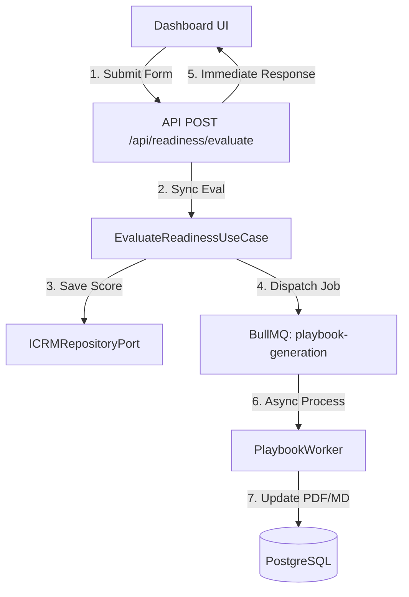

# Plano de Implementação — ZEHLA Readiness & AI Transformation (ZRT) [REVISADO]

Este plano de implementação estabelece a arquitetura para o módulo de maturidade e transformação de IA (**ZEHLA Readiness & AI Transformation - ZRT**), estruturado de acordo com as diretrizes de Clean Architecture, segurança Zero-Trust e performance do ecossistema ZEHLA.

---

## Diretrizes Arquiteturais & Regras de Ouro

> [!IMPORTANT]
> **1. ISOLAMENTO DO NÚCLEO DE DOMÍNIO (`src/domain/readiness/`)**
> Toda a lógica de avaliação, classificação e previsões matemáticas residirá estritamente em `src/domain/readiness/`. O diretório `src/lib/` será reservado exclusivamente para utilitários transversais.
>
> **2. IMUTABILIDADE & MONADS (`Result<T, E>`)**
> Todos os Value Objects de avaliação e categorias serão congelados em memória usando `Object.freeze()`. Métodos de cálculo de scores e previsões retornarão obrigatoriamente a mônada de resultado `Result<T, Error>`.
>
> **3. RLS E SEGURANÇA ZERO-TRUST**
> O endpoint da API extrairá o `tenantId`/`pousadaId` estritamente da assinatura criptográfica do token JWT através do `withApiSecurity`. Proibido receber identificadores no corpo (body) da requisição.
>
> **4. SPEC-DRIVEN FRONTEND (SB22)**
> Separação rígida entre Dumb Components (gráficos de gauge, sliders de ROI e PlaybookViewer que se comunicam apenas por props/callbacks sem dependência de rede) e Smart Hooks (`useReadinessEvaluation` encapsulando requisições e estados do React Query).
>
> **5. ARQUITETURA ASSÍNCRONA E WORKERS**
> Cálculos matemáticos puros e risco LGPD rodam de forma determinística e síncrona na API (resposta em milissegundos). A geração densa do Playbook textual detalhado será enfileirada no BullMQ de forma assíncrona, e a UI fará polling até a conclusão do processamento.

---

## Proposta de Mudanças



### 1. Núcleo de Domínio (`src/domain/` & `src/application/`)

#### [NEW] [ReadinessEvaluator.ts](file:///Users/marciocau/secretaria-ai/src/domain/readiness/entities/ReadinessEvaluator.ts)
- Classe de domínio contendo a lógica de avaliação de maturidade.
- Retorna `Result<ReadinessAssessment, Error>` contendo scores `0-100` e classificação em Value Objects congelados (`Object.freeze`):
  - `CoPilots` (Fase 1: < 40)
  - `Brains` (Fase 2: 40-75)
  - `AutonomousAgents` (Fase 3: > 75)
- Integra-se com o `PIIScanner` do Zehla Data Registry (ZDR) para anonimizar/tokenizar qualquer dado pessoal antes de inferências ou processamentos externos.

#### [NEW] [RoiPredictor.ts](file:///Users/marciocau/secretaria-ai/src/domain/readiness/entities/RoiPredictor.ts)
- Classe determinística que calcula e projeta o ROI estimado de transformação.
- Retorna `Result<RoiPrediction, Error>`.

#### [NEW] [AgentRecommender.ts](file:///Users/marciocau/secretaria-ai/src/domain/readiness/entities/AgentRecommender.ts)
- Consome o histórico estatístico de conversão e latência (`BetaBinomialPosterior` do ZAOS-Router) para priorizar dinamicamente se a propriedade necessita prioritariamente de agentes de comunicação (WhatsApp/Instagram) ou de pricing.
- Retorna `Result<AgentRecommendation[], Error>`.

#### [NEW] [EvaluateReadinessUseCase.ts](file:///Users/marciocau/secretaria-ai/src/application/readiness/use-cases/EvaluateReadinessUseCase.ts)
- Caso de uso que orquestra a avaliação:
  1. Instancia `ReadinessEvaluator` e calcula o score determinístico.
  2. Invoca o repositório (`ICRMRepositoryPort`) para persistir `readinessScore`, `lgpdRiskLevel` e `roiEstimation` na propriedade/lead correspondente do banco.
  3. Enfileira o job de geração do Playbook complexo no BullMQ.
  4. Retorna a avaliação instantânea.

---

### 2. Camada de API & Fila (`src/app/api/` & `src/lib/`)

#### [NEW] [evaluate/route.ts](file:///Users/marciocau/secretaria-ai/src/app/api/readiness/evaluate/route.ts)
- Rota POST protegida pelo `withApiSecurity`.
- Extrai o `tenantId` do JWT.
- Executa síncronamente o cálculo determinístico de ROI/Maturidade e despacha a geração do playbook para a fila.

#### [NEW] [playbook-worker.ts](file:///Users/marciocau/secretaria-ai/src/lib/workers/playbook-worker.ts)
- Worker BullMQ responsável por processar assincronamente a geração densa do documento do Playbook, salvando o status e o caminho do artefato gerado no banco de dados.

---

### 3. Frontend Dashboard Otimizado (`src/app/dashboard/readiness/`)

#### [NEW] [useReadinessEvaluation.ts](file:///Users/marciocau/secretaria-ai/src/hooks/useReadinessEvaluation.ts)
- Smart Hook em React Query que gerencia o fluxo de submissão do formulário, polling do status do playbook do BullMQ e cache das avaliações anteriores.

#### [NEW] [page.tsx](file:///Users/marciocau/secretaria-ai/src/app/dashboard/readiness/page.tsx)
- Dashboard composto exclusivamente por Dumb Components alimentados pelo Smart Hook:
  - Sliders de diária média e quartos otimizados com `useMemo` e `useDebounce` (300ms) para proteger o Event Loop contra re-renderizações excessivas ao arrastar.
  - Gráficos de Gauge e PlaybookViewer puros.

---

## Plano de Verificação

### Testes Automatizados
- **`ReadinessEvaluator.test.ts`**: Testar cálculos determinísticos e garantia de imutabilidade com `Object.isFrozen`.
- **`RoiPredictor.test.ts`**: Testar fórmulas de ROI sob limites matemáticos extremos.
- **`EvaluateReadinessUseCase.test.ts`**: Simular persistência com mock de `ICRMRepositoryPort` e enfileiramento de jobs no BullMQ.

```bash
npx vitest run src/__tests__/readiness/
```

### Verificação Manual
- Validar no navegador que o slider de ROI não causa lag de renderização na interface gráfica do dashboard.
